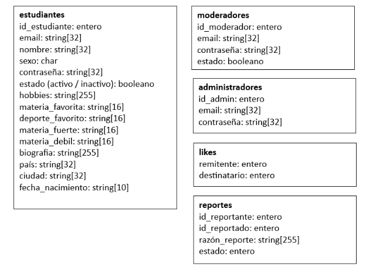

UNIVERSIDAD TECNOLÓGICA NACIONAL FACULTAD REGIONAL ROSARIO 

TRABAJO PRÁCTICO Nº 3: CONSIGNAS ALGORITMOS Y ESTRUCTURAS DE DATOS

# Introducción  
En este TP3 vamos a introducir el concepto de registros y archivos. 

Deben realizar la codificación en lenguaje Python de lo requerido para este TP3. 

Junto al código de Python, indicar claramente la declarava de variables ulizadas, en especial, las referidas a las variables del po registros, archivos y arrays de registros. 

Tener en cuenta al implementar los archivos en Python, respetar el marco teórico de la cátedra sobre archvios, es decir, se debe ulizar la librería pickle, y los archivos deben contener registros del mismo tamaño dentro de cada fila. 

Antes de comenzar con este TP, por favor leer el documento **Enunciado General** de manera completa,  para  saber  de  qu  va  el  negocio,  y  entender  el  modelo  de  datos  requerido .  Es obligatoria tambin la lectura de las  **preguntas frecuentes**, para evitar práccas que resten puntos al momento de la entrega. 

# Desarrollo 
En esta tercera etapa deberán realizar lo siguiente: 

- Al comenzar con la ejecución del programa, hacer que el usuario elija la opción “logueo” o “registrarse”. 
- Los  estudiantes,  moderadores  y  administradores  deberán  guardarse  en archivos.  Sólo  los  estudiantes  se  pueden  dar  de  alta  al  comienzo  de  la ejecución  del  programa.  Los  administradores  deberán  estar  previamente cargados en el archivo, y no podrán darse de alta en la sección de “registro”. Los moderadores sólo podrán darse de alta a travs de un administrador (ver sección 1.b del menú de administradores). 
- Para acceder a la sección de logueo, deberá haber aunque sea 1 moderador, 1 administrador y 4 estudiantes cargados. 
- Reutilizar  la  mayor  cantidad  del  código  posible  del  TP2,  a  menos  que explícitamente se haya pedido reformularlo en las correcciones. Obviamente, adaptarlo para que en lugar de utilizar arreglos utilice archivos. 
- No puede haber 2 usuarios que compartan el mismo email. Chequear tambin que no existan usuarios de distinto tipo con el mismo email. 
- Hacer el menú para cada tipo de usuario (Estudiante, Administrador y Moderador).  
- Pedir un nombre de usuario (email) y contraseña al operador. Verificar que existan el usuario y su clave guardados en el sistema, y de acuerdo al tipo de usuario que está ingresando, presentarle el menú correspondiente.  
- Tener  en  cuenta  que,  además  de  ingresar  un  par  usuario  /  contraseña correctos, tambin se debe chequear que el estado del usuario sea “ACTIVO” (string). Caso contrario, el login NO será correcto. 
- Tanto el ID de cada estudiante como de cada moderador o administrador va a ser siempre un número entero auto-incremental, que comienza en 0. 

Si el usuario que ingresa (por medio de su nombre de usuario y su clave) coincide con un usuario guardado, y el mismo es del tipo **Estudiante**, deberán mostrar el menú completo correspondiente a un usuario de ese tipo: 

1. Gesonar mi perfil 
   1. Editar mis datos personales 
   1. Eliminar mi perfil 
   1. Volver 
1. Gesonar candidatos 
   1. Ver candidatos 
   1. Reportar un candidato 
   1. Volver 
1. Matcheos 
   1. Ver matcheos 
   1. Eliminar un matcheo 
   1. Volver 
1. Reportes estadíscos 
0. Salir 

Tener en cuenta que apenas se ejecuta el programa, solamente se verán las opciones: 

1. Gesonar mi perfil 
1. Gesonar candidatos 
1. Matcheos 
1. Reportes estadíscos 
0. Salir 

Y luego las opciones con letras o sub-opciones se mostrarán luego de elegir alguna opción principal. Al elegir la opción “Volver” en cualquiera de los sub-menús, se volverá al menú anterior. 

Si el usuario que ingresa (por medio de su nombre de usuario y su clave) coincide con un usuario guardado,  y  el  mismo  es  del  tipo  **Moderador**,  deberán  mostrar  el  menú  completo correspondiente a un usuario de ese tipo: 

1. Gestionar usuarios 
1. Desactivar usuario 
2. Volver 
2. Gestionar Reportes 
   1. Ver reportes 
   1. Volver 
2. Reportes Estadísticos 

Si el usuario que ingresa (por medio de su nombre de usuario y su clave) coincide con un usuario guardado,  y  el  mismo  es  del  tipo  **Administrador**,  deberán  mostrar  el  menú  completo correspondiente a un usuario de ese tipo: 

1. Gestionar usuarios 
   1. Eliminar un usuario (incluyendo moderadores) 
   1. Dar de alta un moderador 
   1. Desactivar usuario 
   1. Volver 
1. Gestionar Reportes 
   1. Ver reportes 
   1. Volver 
1. Reportes Estadísticos 

## Módulo 0: inicialización 
Si  no  existen  likes  cargados,  desarrollar  un  procedimiento  que  se  llame  al  comienzo  de  la ejecución de nuestro programa. El mismo deberá recorrer el archivo de likes, y llenarla de 0s y 1s de manera aleatoria. De esta manera, cada vez que el programa se ejecute, vamos a tener cargada cierta  interacción  entre  los  estudiantes.  Si  ya  se  enen  likes  cargados  en  el  archivo correspondiente, NO llamar a dicho procedimiento.

## Módulo 1: Estudiantes 
Para esta tercera etapa, se pedirán realizar los módulos:  

1. Gesonar mi perfil 
   1. Editar mis datos personales 
   1. Eliminar mi perfil 
1. Gesonar candidatos 
1. Ver candidatos 
1. Reportar un candidato 

4\.  Reportes Estadíscos 

El resto de las opciones deberán mostrar un cartel aclaratorio que diga “En Construcción”. Descripción de los módulos: 

**1.a Editar mis datos personales:** en esta opción, el estudiante logueado deberá poder modificar la información ingresada para su fecha de nacimiento, biograa, hobbies y cualquier otro campo que crean relevante. 

**1.b Eliminar mi perfil:** mostrar un cartel aclaratorio, preguntando confirmación si realmente se desea eliminar el perfil. En caso de elegir la opción “si”, cambiar el estado del usuario por inacvo, y volver a la pantalla de login del trabajo. 

**2.a Ver candidatos:** al ingresar a esta opción, se deben mostrar todos los estudiantes. Mostrar nombre, fecha de nacimiento, edad, biograa y hobbies. Una vez mostrada toda la información, permir ingresar en una variable me -gusta el nombre del estudiante con el cual le gustaría en un futuro hacer un Matcheo. Verificar que el nombre sea correcto. 

Para mostrar la edad, sabiendo que la fecha de nacimiento se guarda como string en el formato YYYY-MM-DD siendo YYYY el año, MM el mes y DD el día (ej: el 1 de diciembre de 2002 sería 2002- 12-01), calcular y mostrar la edad del candidato. 

Se recomienda guardar en un archivo un po de registro Like, donde se guarde el  Id del remitente del like (quin lo dio) y el  Id del desnatario (a quin). Codificar dos funciones auxiliares, una para saber si una persona le dio like a otra (usando los IDs de ambos como parámetros), y otra para saber  si  dos  personas  enen  likes  correspondidos  (también  usando  ambos  IDs  como parámetros=. 

|   | remitente | destinatario |
|:-:|:---------:|:------------:|
| 0 | 0         | 1            |
| 1 | 0         | 2            |
| 2 | 0         | 3            |
| 3 | 1         | 4            |
| 4 | 2         | 3            |
| 5 | 3         | 2            |
| 6 | 4         | 3            |
| 7 | 3         | 4            |

En este ejemplo: el Id 0 le ha dado me gusta a 3 estudiantes, al 1, al 2 y al 3. El Id 1 solamente le ha dado me gusta al id 4. Esto quiere decir que el usuario 0 le dió like al usuario 1, pero el usuario 1 solo le dió like al usuario 4, por ende, No hay match. Mientras que el id 2 le dio like al 3 y el 3 al 2 por ende, Si hay match.  

**2.b Reportar un Candidato:** al ingresar a esta sección, se deberá pedir el ID o nombre de usuario (cualquiera de los dos) de un candidato, y el movo por el cual se está reportando al mismo. Validar que el candidato exista, y dar de alta un reporte con el ID del usuario actual como reportante, el ID del usuario reportado, el movo dado y el estado inicial 0  *(ver sección 2.a de moderadores para obtener más información acerca de los distintos estados de un reporte).*** 

**4. Reportes Estadíscos:** mostrar con qué porcentaje de todos los candidatos posibles (disntos a nosotros) se matcheo ambas veces, a cuántos le pusimos “me gusta” pero no nos han devuelto el match, y cuántos estudiantes nos dieron “me gusta”, a los cuáles nosotros no le hemos dado “me gusta todavía”. Mostrarlo de la siguiente forma: 

Matcheados sobre el % posible: 50%  
Likes dados y no recibidos: 2  
Likes recibidos y no respondidos: 3 

## Módulo 2: Moderadores 
Para esta tercera etapa, se pedirán realizar los módulos: 

1. Gestionar usuarios 
   1. Desactivar usuario 
   1. Volver 
1. Gestionar Reportes 
1. Ver reportes 
1. Volver 

**1.a Desactivar un Usuario:** se ingresa el ID o el nombre de usuario, se busca si el usuario existe, y luego se muestra una pantalla idntica a la de “Eliminar mi Perfil”. 

**2.a Ver reportes:** los reportes pueden tener como estado 0, 1 y 2. 0 quiere decir que el reporte todavía no ha sido visto por un moderador o un administrador, 1 quiere decir que el reporte ha sido tomado y el reportado ha sido desacvado, y 2 quiere decir que el reporte ha sido ignorado. 

Se mostrarán los reportes los cuáles tanto el usuario reportante como el reportado están acvos, y que tengan un estado = 0. Por cada reporte, se preguntará cómo se quiere proceder: ignorar reporte o bloquear al reportante. En caso de seleccionar la primer opción, el estado del reporte será actualizado a 2. En caso de seleccionar la segunda opción, el estado del reporte será actualizado a 1, y el usuario reportado será desacvado (su estado será inacvo ). 

## Módulo 3: Administradores 
Además de todo lo referido a moderadores, se pedirá en esta tercera etapa agregar las secciones descritas en negrita: 

1. Gestionar usuarios 
1. **Eliminar un usuario (incluyendo moderadores)** 
1. **Dar de alta un moderador** 
1. Desactivar usuario 
1. Volver 
2. Gestionar Reportes 
   1. Ver reportes 
   1. Volver 
2. **Reportes Estadísticos** 

**1.a Eliminar un usuario:** se desea eliminar del archivo (borrado físico) a un usuario, ya sea estudiante o moderador. Un administrador NO podrá borrar otros administradores. 

**1.b Dar de alta un moderador:** esta sección será similar a la de “registro”, con la diferencia que sólo los administradores podrán crear desde su menú (una vez logueados) nuevos moderadores. 

**3  Reportes  estadísticos:**  además  de  las  mismas  mtricas  que  ve  un  moderador,  se  desean obtener: 

- La cantidad de reportes realizados por los estudiantes 
- El porcentaje de reportes ignorados 
- El porcentaje de reportes aceptados (donde se ha bloqueado al estudiante) 
- El moderador que mayor cantidad de reportes ha ignorado 
- El moderador que mayor cantidad de reportes ha aceptado 
- El moderador que mayor cantidad de reportes ha procesado (ignorados + aceptados)  

# Bonus Track 1: puntuando candidatos 
Se desea realizar un algoritmo que nos permita darle un “puntaje” a los candidatos, de acuerdo a la candad de likes recibidos y dados. Vamos a llamar like “correspondido” a un match, en 

otras palabras, si le damos like a otra persona, y esa persona nos dio like a nosotros va a ser un like “correspondido”. 

Se desea recorrer secuencialmente el archivo de likes. Si encontramos un like dado por el candidato y correspondido por la otra persona, sumarle 1 punto. Si encontramos 1 like que fue dado y no correspondido, restarle 1 punto. 

Además, se desea dar 1 punto más si la “racha” de likes correspondida es mayor o igual a 3. Esto es, a parr del 3er like correspondido sumar 1 punto extra siempre y cuando la racha se mantenga mayor o igual a 3. Si volvemos a encontrar un like no correspondido la racha vuelve a 0. 

Emir un listado de candidatos según su puntaje , que sólo podrán ver los administradores. 

# Bonus Track 2: super-like 
Al registrarse un nuevo estudiante, se le podrá asignar 1 “super-like”. Al ver los candidatos, el usuario podrá ulizarlo con cualquier persona. Al dar un “super like”, automácamente el like que dé, va a ser correspondido (aunque la otra persona no haya dado like, automácamente se realizará el match). 

En otras palabras, completar acá automácamente 2 registros para que haya matcheo, o sea, 1 registro con el like que dé el estudiante que tenga el 'super-like', y el otro registro para que tenga su correspondencia automáca , es decir, Ida y vuelta. Como si al que le diste like te devuelve el like automácamente . 

# Bonus Track 3: revelar candidato 
Al registrarse un nuevo estudiante, se le otorgarán 1 crdito para “revelar candidatos”. Si el estudiante aún no ha ulizado dicho crédito, se mostrará una nueva opción en el menú, justo debajo de “ver candidatos”, que mostrará hasta 3 personas que le han dado like al estudiante logueado (y que no hayan sido correspondidos aún por este). 

